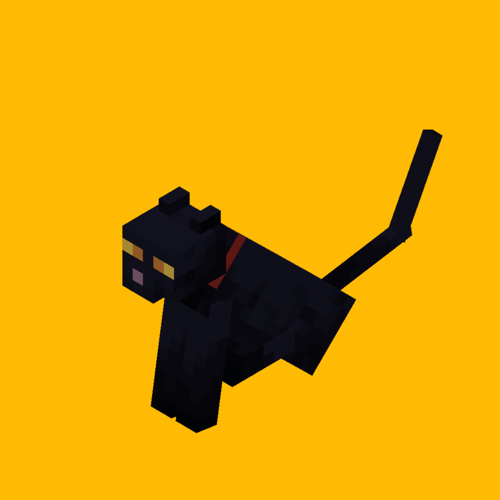

# Immortal Cats [Forge Mod]

This mod renders **all cats—tamed or feral—completely untouchable**. No damage. No red tint. No hurt sounds. No knockback. Your sword is but a suggestion to them.

Hit one? They meow. They spawn hearts. You look silly.

The cats do not fear you.

You live in _their_ apocalypse now.

**Requirements**  
- Minecraft 1.19.2  
- Forge 43.3.2  
- A soul brave enough to face immortal feline overlords  

**Usage**  
- Drop the JAR in your `mods` folder.  
- For servers, install on both server and client, or the cats will mock your hubris.  
- Launch Minecraft.  
- Punch a cat (you monster). Watch it meow and shower hearts.  
- Regret your choices as they stare, unyielding.  
- No issues unless you’ve got mods meddling with animal behavior.

_Written in a trance. Vibe-coded at 3AM._